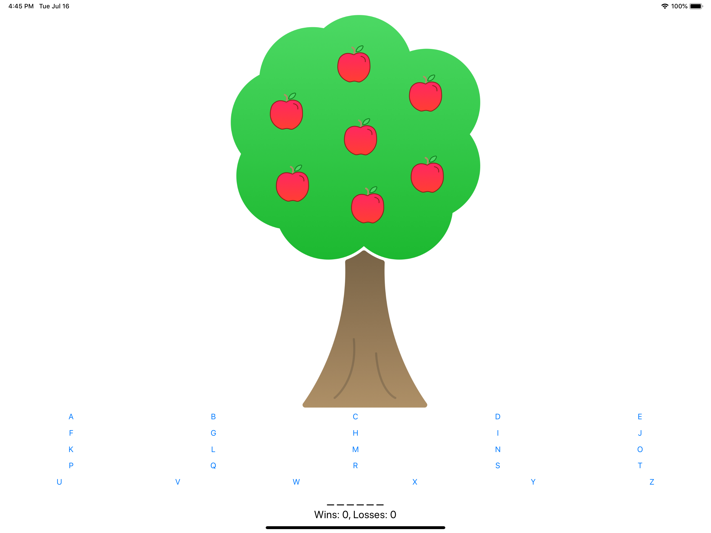
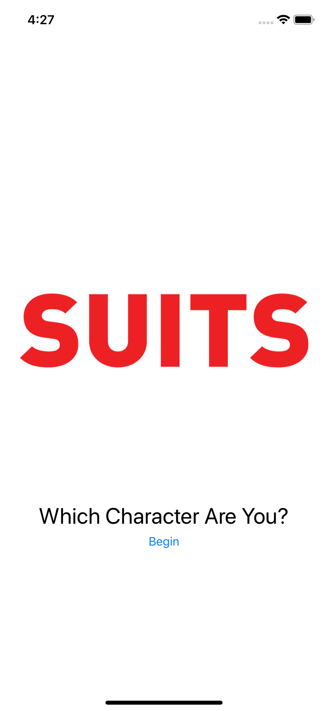
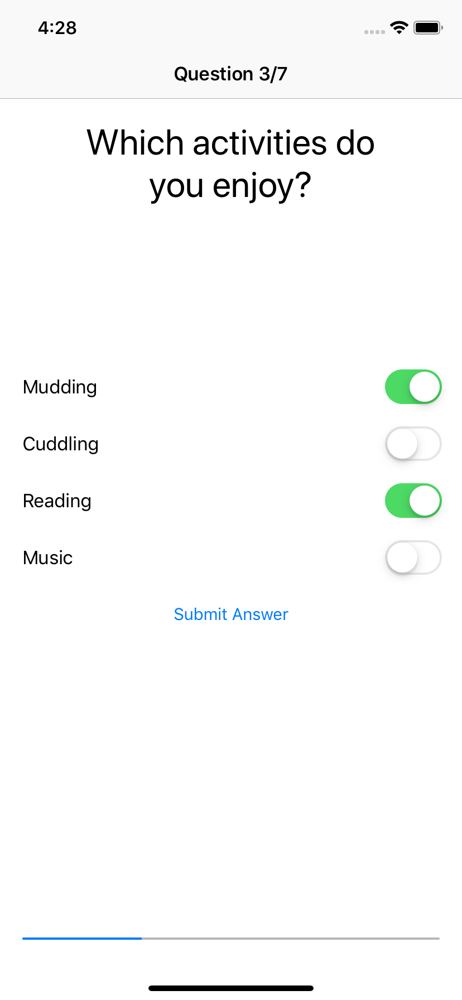
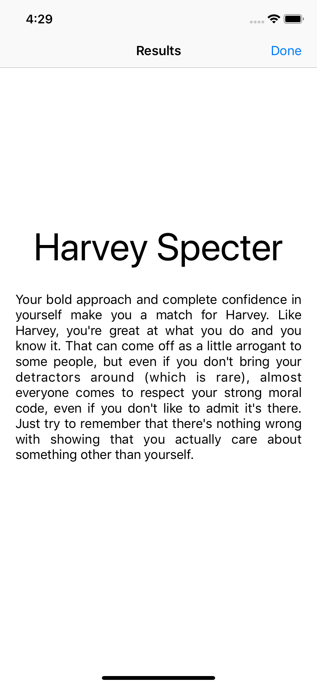
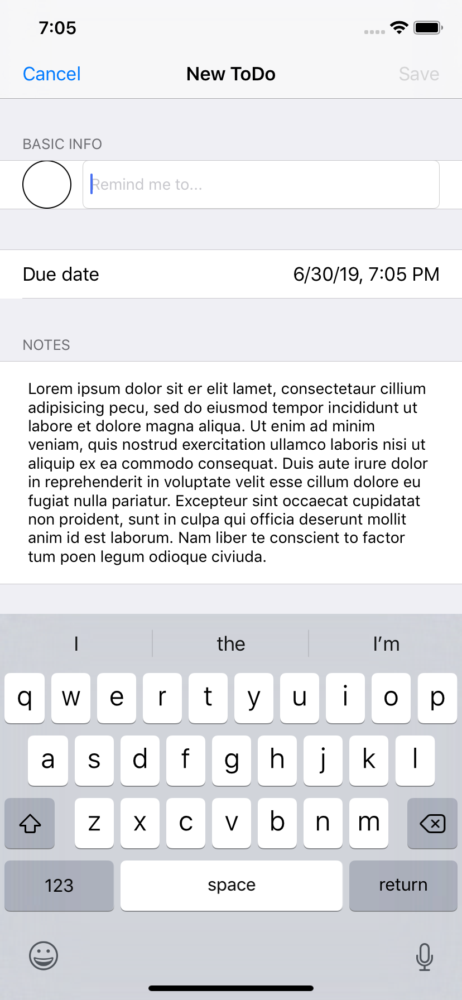
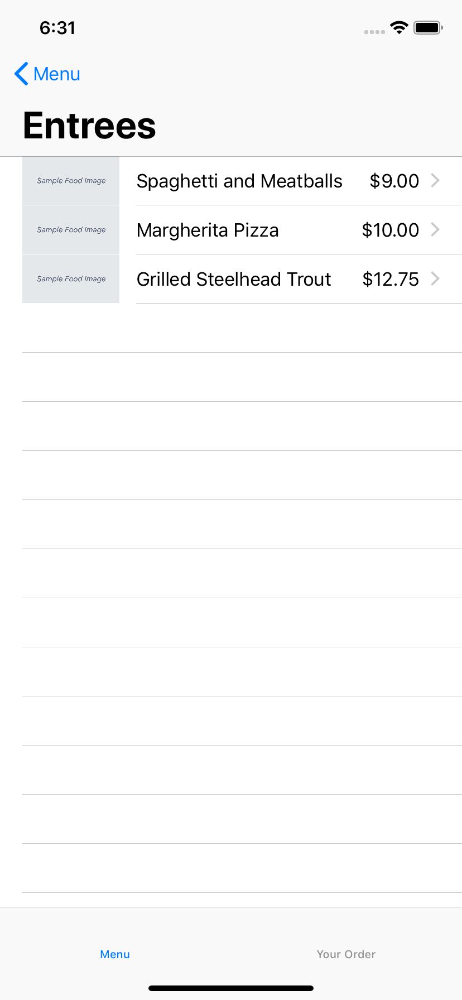
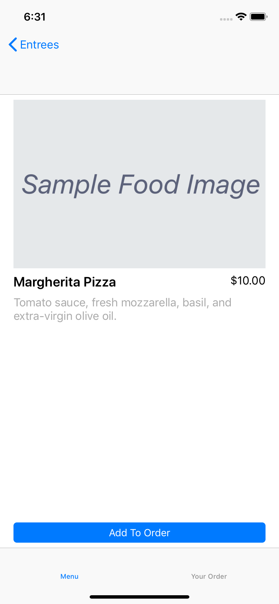
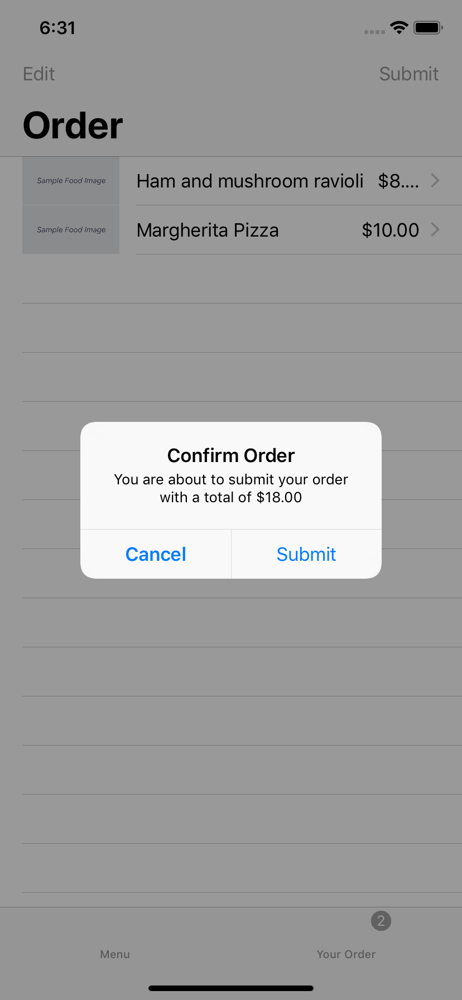

# Mobile Applllication Development with - SWIFT Session 02

  

Labs and guided projects following Apple's [App Development with Swift](https://itunes.apple.com/za/book/app-development-with-swift/id1219117996?mt=11) book.

## Projects and Labs
### <a href="1 Getting Started/Guided Project - Light/">1 Light - Getting Started with App Development</a>
Single screen app that changes the screen from black to white whenever the user taps a button.

   

<table>
  <tr>
    <th>🦅 Swift Lessons</th>
    <th> Learning outcomes</th>
  </tr>
  <tr>
    <td>Introduction to Swift and Playgrounds</a></td>
    <td>
        <ul>
            <li>Learned about the features that make Swift a "safe" language such as <b>type safety</b>, <b>type inference</b>, <b>error handling</b> and <b>optionals</b>.</li>
            <li>Used playgrounds to run Swift code.</li>
            <li><a href="1 Getting Started/1 Intro to Swift Playgrounds/">Lab - Introduction</a></li>
        </ul>
    </td>
  </tr>
  <tr>
    <td>Constants, Variables and Data Types</td>
    <td>
        <ul>
            <li>Learned why most variables should be declared as constants.</li>
            <li>Demonstrated how to specify the type for a variable or constant.</li>
            <li>Showed how to format integer and float values for easier reading.</li>
            <li><a href="1 Getting Started/2 Constants, Variables, and Data Types/">Lab - Constants and Variables</a></li>
        </ul>
    </td>
  </tr>
  <tr>
    <td>Operators</td>
    <td>
      <ul>
        <li>Did basic mathematic operations using <code>+</code>, <code>-</code>, <code>×</code>, <code>÷</code> and most notably the remainder/modulo operator <code>%</code>.</li>
        <li>Used <b>compound assignment operators</b> such as <code>+=</code>, <code>-=</code>, <code>*=</code> and <code>/=</code>.</li>
        <li><a href="1 Getting Started/3 Operators/">Lab - Operators</a></li>
      </ul>
    </td>
  </tr>
  <tr>
    <td>Control Flow</td>
    <td>
      <ul>
        <li>Combined <b>boolean expressions</b> with <b>logical operators</b> to convey some logic.</li>
        <li>Used <b><code>switch</code> statements</b> to choose which code gets executed depending on the value of a single variable.</li>
        <li>Learned how to use a <b>ternary operator</b> to conditionally assign different values to a constant or variable.</li>
        <li><a href="1 Getting Started/4 Control Flow/">Lab - Control Flow</a></li>
      </ul>
    </td>
  </tr>
  <tr>
    <th>🔨 SDK Lessons</th>
    <th> Learning outcomes</th>
  </tr>
  <tr>
    <td>Xcode</td>
    <td>
      <ul>
        <li>Learned how to use the <b>project navigator</b>, <b>debug area</b>, <b>assistant editor</b> and <b>version editor</b>.</li>
      </ul>
    </td>
  </tr>
  <tr>
    <td>Building, running and debugging an app</td>
    <td>
      <ul>
        <li>Learned how to run apps using Simulator within the Xcode environment and with a physical device.</li>
        <li>Performed basic debugging using breakpoints.</li>
        <li><a href="1 Getting Started/6 Debugging/">Lab - Debug Your First App</a></li>
      </ul>
    </td>
  </tr>
  <tr>
    <td>Documentation</td>
    <td>
      <ul>
        <li>Used the documentation browser to look at overviews, symbol descriptions and discussions.</li>
        <li>Used resources on the Apple Developer website to find sample code and framework guides.</li>
        <li><a href="1 Getting Started/7 Documentation/">Lab - Use Documentation</a></li>
      </ul>
    </td>
  </tr>
  <tr>
    <td>Interface Builder Basics</td>
    <td>
      <ul>
        <li>Saw the purpose of the <b>initial view controller</b> in a storyboard.</li>
        <li>Described the role of the <b>document outline</b>.</li>
        <li>Demonstrated how to create an <code>IBOutlet</code> and an <code>IBAction</code> using the <b>assistant editor</b>.</li>
        <li>Explained the differences between the <b>identity inspector</b>, <b>attributes inspector</b>, <b>size inspector</b> and the <b>object library</b> to build basic user interfaces.</li>
      </ul>
    </td>
  </tr>
</table>

### <a href="2 Introduction to UIKit/Guided Project - Apple Pie/">2 Apple Pie - Introduction to UIKit</a>
Word guessing game for the iPad in the style of the classic Hangman.

  

<table>
  <tr>
    <th>🦅 Swift Lessons</th>
    <th> Learning outcomes</th>
  </tr>
  <tr>
    <td>Strings</td>
    <td>
      <ul>
        <li>Did string comparisons.</li>
        <li>Used <b>string interpolation</b> to create a complex variable string.</li>
        <li>Used numerous methods included in Swift as part of the string class such as <code>uppercase()</code> and <code>lowercase()</code>.</li>
        <li><a href="2 Introduction to UIKit/1 Strings/">Lab - Strings</a></li>
      </ul>
    </td>
  </tr>
  <tr>
    <td>Functions</td>
    <td>
      <ul>
        <li>Built functions with and without return types.</li>
        <li>Constructed functions with multiple named arguments and default values.</li>
        <li>Demonstrated how to specify <b>external names</b> for function parameters.</li>
        <li><a href="2 Introduction to UIKit/2 Functions/">Lab - Functions</a></li>
      </ul>
    </td>
  </tr>
  <tr>
    <td>Structures</td>
    <td>
      <ul>
        <li>Learned about the role of <b>structures</b> in Swift and how to create one with multiple <b>instance methods</b>.</li>
        <li>Learned the difference between an <b>instance</b> and a <b>type</b>.</li>
        <li>Demonstrated how to create custom initialisers for a structure.</li>
        <li>Showed how create a <b>computed property</b>.</li>
        <li>Created a structure with a <b>type method</b>.</li>
        <li><a href="2 Introduction to UIKit/3 Structures/">Lab - Structures</a></li>
      </ul>
    </td>
  </tr>
  <tr>
    <td>Classes and Inheritance</td>
    <td>
      <ul>
        <li>Outlined the difference between a structure and a class.</li>
        <li>Learned the concept and importance of <b>inheritance</b>.</li>
        <li>Used classes to manage complex state in an application</li>
        <li>Demonstrated how to call a <b>superclass</b>'s properties or methods.</li>
        <li>Showed how to <b>override</b> methods from a superclass.</li>
        <li><a href="2 Introduction to UIKit/4 Classes and Inheritance/">Lab - Classes</a></li>
      </ul>
    </td>
  </tr>
  <tr>
    <td>Collections</td>
    <td>
      <ul>
        <li>Described the difference between <code>let</code> and <code>var</code> when using collection types.</li>
        <li>Learned how to add and remove values from <b>arrays</b> and <b>dictionaries</b>.</li>
        <li><a href="2 Introduction to UIKit/5 Collections/">Lab - Collections</a></li>
      </ul>
    </td>
  </tr>
  <tr>
    <td>Loops</td>
    <td>
      <ul>
        <li>Demonstrated how to write a <code>for</code> loop to iterate over a <b>range</b> or collection.</li>
        <li>Showed how to write  a <code>while</code> loop.</li>
        <li><a href="2 Introduction to UIKit/6 Loops/">Lab - Loops</a></li>
      </ul>    
    </td>
  </tr>
  <tr>
    <th>🔨 SDK Lessons</th>
    <th> Learning outcomes</th>
  </tr>
  <tr>
    <td>Introduction to UIKit</td>
    <td>
      <ul>
        <li>Learned about the standard controls included in the iOS SDK made available in a framework known as <code>UIKit</code>.</li>
        <li><a href="2 Introduction to UIKit/7 Introduction to UIKit/">Lab - UIKit Survey</a></li>
      </ul>
    </td>
  </tr>
  <tr>
    <td>Displaying Data</td>
    <td>
      <ul>
        <li>Showed how to configure views using Interface Builder.</li>
        <li>Demonstrated how to set a <b>label</b>'s text, font, colour and other properties.</li>
        <li>Learned how to set the <b>content mode</b> for an image view.</li>
        <li><a href="2 Introduction to UIKit/8 Displaying Data/">Lab - Tutorial Screen</a></li>
      </ul>
    </td>
  </tr>
  <tr>
    <td>Controls in Action</td>
    <td>
      <ul>
        <li>Learned how to use a <b>button</b>, <b>switch</b>,  and <b>slider</b> to execute code.</li>
        <li>Learned how to access the value of a switch, slider and <b>text field</b>.</li>
        <li>Learned how to respond to user interactions with gesture recognisers.</li>
        <li>Learned how to connect <b>controls</b> to <b>actions</b> programmatically.</li>
        <li><a href="2 Introduction to UIKit/9 Controls in Action/">Lab - Basic Interactions</a></li>
      </ul>
    </td>
  </tr>
  <tr>
    <td>Auto Layout and Stack Views</td>
    <td>
      <ul>
        <li>Described the <b>Auto Layout</b> system for constraining views as they relate to other views.</li>
        <li>Demonstrated how to add constraints to a view.</li>
        <li>Showed how to use <b>stack view</b> to help manage constraints.</li>
        <li><a href="2 Introduction to UIKit/10 Auto Layout and Stack Views/">Lab - Calculator</a></li>
      </ul>
    </td>
  </tr>
</table>

### <a href="3 Navigation and Workflows/Guided Project - PersonalityQuiz/">3 Quiz - Navigation and Workflows</a>
A simple app that guides the user through a personality quiz and displays the results.

    

<table>
  <tr>
    <th>🦅 Swift Lessons</th>
    <th> Learning outcomes</th>
  </tr>
  <tr>
    <td>Optionals</td>
    <td>
      <ul>
        <li>Learned how to create variables or constants that may not have a value.</li>
        <li>Demonstrated how to <b>force-unwrap</b> an optional value.</li>
        <li>Showed how to use <b>optional binding</b> to use the value of an optional.</li>
        <li>Created <b>failable initialisers</b>.</li>
        <li>Described and explained the proper use of the <b>implicitly unwrapped</b> optionals.</li>
        <li><a href="3 Navigation and Workflows/1 Optionals/">Lab - Optionals</a></li>
      </ul>
    </td>
  </tr>
  <tr>
    <td>Type Casting and Inspection</td>
    <td>
      <ul>
        <li>Learned how to <b>downcast</b> an object to a particular type before accessing its properties and methods.</li>
        <li><a href="3 Navigation and Workflows/2 Type Casting/">Lab - Type Casting</a></li>
      </ul>
    </td>
  </tr>
  <tr>
    <td>Guard</td>
    <td>
      <ul>
        <li>Described how <code>guard</code> differs from <code>if-let</code> syntax.</li>
        <li>Demonstrated how to build a function that guards against invalid arguments.</li>
        <li><a href="3 Navigation and Workflows/3 Guard/">Lab - Guard</a></li>
      </ul>
    </td>
  </tr>
  <tr>
    <td>Constant and Variable Scope</td>
    <td>
      <ul>
        <li>Learned about <b>global</b> and <b>local scope</b>.</li>
        <li>Demonstrated how to re-use variable names using <b>variable shadowing</b>.</li>
        <li><a href="3 Navigation and Workflows/4 Scope/">Lab - Scope</a></li>
      </ul>
    </td>
  </tr>
  <tr>
    <td>Enumerations</td>
    <td>
      <ul>
        <li>Explained why <b>enumerations</b> are a useful tool.</li>
        <li>Demonstrated how to define enumerations with raw values.</li>
        <li>Learned how to work with enumerations using the <code>switch</code> statement.</li>
        <li><a href="3 Navigation and Workflows/5 Enumerations/">Lab - Enumerations</a></li>
      </ul>
    </td>
  </tr>
  <tr>
    <th>🔨 SDK Lessons</th>
    <th> Learning outcomes</th>
  </tr>
  <tr>
    <td>Segues and Navigation Controllers</td>
    <td>
      <ul>
        <li>Learned how to use <b>segues</b> to navigate between scenes.</li>
        <li>Used <code>prepare</code> to move information across view controllers.</li>
        <li>Identified customisation points for a <b>navigation bar</b>.</li>
        <li><a href="3 Navigation and Workflows/6 Segues and Navigation Controllers/">Lab - Login</a></li>
      </ul>
    </td>
  </tr>
  <tr>
    <td>Tab Bar Controllers</td>
    <td>
      <ul>
        <li>Learned when to use a <b>tab bar controller</b>.</li>
        <li>Identified customisation points for a tab bar controller.</li>
        <li><a href="3 Navigation and Workflows/7 Tab Bar Controllers/">Lab - About Me</a></li>
      </ul>
    </td>
  </tr>
  <tr>
    <td>View Controller Life Cycle</td>
    <td>
      <ul>
        <li>Identified the correct events in a view controller life cycle for executing setup and long-running view logic.</li>
        <li><a href="3 Navigation and Workflows/8 View Controller Life Cycle/">Lab - Order of Events</a></li>
      </ul>
    </td>
  </tr>
  <tr>
    <td>Building Simple Workflows</td>
    <td>
      <ul>
        <li>Learned about the role of the <b>iOS Human Interface Guidelines</b> as a reference for building simple feature workflows and navigation hierarchies.</li>
        <li><a href="3 Navigation and Workflows/9 Building Simple Workflows/">Lab - Pizza Delivery</a></li>
      </ul>
    </td>
  </tr>
</table>

### <a href="4 Tables and Persistence/Guided Project - List/">4 List - Tables and Persistence</a>
A task-tracking app that allows the user to add, edit and delete tasks in a familiar master-detail interface.

   

<table>
  <tr>
    <th>🦅 Swift Lessons</th>
    <th> Learning outcomes</th>
  </tr>
  <tr>
    <td>Protocols</td>
    <td>
      <ul>
        <li>Described the purpose of protocols.</li>
        <li>Demonstrated how to adopt and define a protocol.</li>
        <li>Used included Swift protocols such as <code>CustomStringConvertible</code>, <code>Equatable</code>, <code>Comparable</code> and <code>Codable</code>.
        <li>Implemented the delegate pattern using protocols.</li>
        <li>Learned how to add a default implementation to a protocol function.</li>
        <li><a href="4 Tables and Persistence/1 Protocols/">Lab - Protocols</a></li>
      </ul>
    </td>
  </tr>
  <tr>
    <th>🔨 SDK Lessons</th>
    <th> Learning outcomes</th>
  </tr>
  <tr>
    <td>App Anatomy and Life Cycle</td>
    <td>
      <ul>
        <li>Learned how to execute code at different stages of the app life cycle.</li>
        <li><a href="4 Tables and Persistence/2 App Anatomy and Life Cycle/">Lab - App Event Count</a></li>
      </ul>
    </td>
  </tr>
  <tr>
    <td>Model View Controller</td>
    <td>
      <ul>
        <li>Learned how to use the Model-View-Controller architecture pattern for organising how an app works.</li>
        <li><a href="4 Tables and Persistence/3 Model View Controller/">Lab - Favorite Athletes</a></li>
      </ul>
    </td>
  </tr>
  <tr>
   <td>Scroll Views</td>
    <td>
      <ul>
        <li>Learned when and how to use scroll views with <b>auto layout</b> and <b>stack views</b>.</li>
        <li><a href="4 Tables and Persistence/4 Scroll Views/">Lab - I Spy</a></li>
      </ul>
    </td>
  </tr>
  <tr>
    <td>Table Views</td>
    <td>
      <ul>
        <li>Learned how to provide dynamic data to a table view.</li>
        <li>Demonstrated how to respond to user interaction in a table view.</li>
        <li>Used predefined <code>UITableViewCell</code> styles to customise table views.</li>
        <li><a href="4 Tables and Persistence/5 Table Views/">Lab - Meal Tracker</a></li>
      </ul>
    </td>
  </tr>
  <tr>
    <td>Intermediate Table Views</td>
    <td>
      <ul>
        <li>Learned how to create custom-designed cells.</li>
        <li>Showed how to use table view editing to enable swipe functionality.</li>
        <li>Described the use cases of a static table view.</li>
        <li>Used custom row actions.</li>
        <li><a href="4 Tables and Persistence/6 Intermediate Table Views/">Lab - Favorite Books</a></li>
      </ul>
    </td>
  </tr>
  <tr>
    <td>Saving Data</td>
    <td>
      <ul>
        <li>Learned how to write and access files in the app's Document directory.</li>
        <li>Serialised model data to a format that can be saved and used in the app.</li>
        <li><a href="4 Tables and Persistence/7 Saving Data/">Lab - Remember Your Emojis</a></li>
      </ul>
    </td>
  </tr>
  <tr>
    <td>System View Controllers</td>
    <td>
      <ul>
        <li>Learned how to present and respond to action in an alert controller.</li>
        <li>Demonstrated how to present an activity view controller.</li>
        <li>Showed how to present a mail compose view controller.</li>
        <li>Demonstrated how to access and respond to selections in an <b>image picker</b>.</li>
        <li>Showed how to present a Safari view controller.</li>
        <li><a href="4 Tables and Persistence/8 System View Controllers/">Lab - Home Furniture Sharing</a></li>
      </ul>
    </td>
  </tr>
  <tr>
    <td>Building Complex Input Screens</td>
    <td>
      <ul>
        <li>Learned to build custom forms to create new model objects for data entry.</li>
        <li>Demonstrated how to use a custom protocol and delegate for passing data between view controllers.</li>
        <li>Used <code>UITableViewDelegate</code> methods to dynamically resize table cells.</li>
        <li><a href="4 Tables and Persistence/9 Building Complex Input Screens/">Lab - Employee Roster</a></li>
      </ul>
    </td>
  </tr>
</table>

### <a href="5 Working with the Web/Guided Project - Restaurant/">5 Restaurant - Working with the Web</a>
The Restaurant app allows the user to browse a customisable menu that fetches information from a web service.

    

<table>
  <tr>
    <th>🦅 Swift Lessons</th>
    <th> Learning outcomes</th>
  </tr>
  <tr>
    <td>Closures</td>
    <td>
      <ul>
        <li>Learned how to define an <b>anonymous function</b> and use <b>syntactic sugar</b>.</li>
        <li>Demonstrated how to pass a closure as a function argument.</li>
        <li>Used the <code>sort</code>, <code>filter</code>, <code>reduce</code> and <code>map</code> functions.</li>
        <li><a href="5 Working with the Web/1 Closures/">Lab - Closures</a></li>
      </ul>
    </td>
  </tr>
  <tr>
    <td>Extensions</td>
    <td>
      <ul>
        <li>Learned how to define an extension to add functionality and an initialiser to a predefined type.</li>
        <li><a href="5 Working with the Web/2 Extensions/">Lab - Extensions</a></li>
      </ul>
    </td>
  </tr>
  <tr>
    <th>🔨 SDK Lessons</th>
    <th> Learning outcomes</th>
  </tr>
  <tr>
    <td>Practical Animation</td>
    <td>
      <ul>
        <li>Learned when and how to use animations using <code>UIKit</code> to enhance the user experience.</li>
        <li><a href="5 Working with the Web/3 Practical Animation/">Lab - Contest</a></li>
      </ul>
    </td>
  </tr>
  <tr>
    <td>Working with the Web: HTTP and URL Session</td>
    <td>
      <ul>
        <li>Described the basics of the <b>HTTP networking protocol</b>, including commonly used <b>methods</b>, <b>response types</b> and <b>response codes</b>.</li>
        <li>Learned the different parts a URL and created a URL with <b>query items</b>.</li>
        <li>Demonstrated how to use the <b>shared URL Session</b> to perform basic HTTP methods for sending and receiving information.</li>
        <li><a href="5 Working with the Web/4 HTTP and URL Session/">Lab - iTunes Search (Part 1)</a></li>
      </ul>
    </td>
  </tr>
  <tr>
    <td>Working with the Web: Decoding JSON</td>
    <td>
      <ul>
        <li>Described the <b>JavaScript Object Notation</b> and the role it plays in working with network services.</li>
        <li>Demonstrated how to use <code>JSONEncoder</code> and <code>JSONDecoder</code> to encode and decode JSON.</li>
        <li>Showed how to decode JSON data into custom model objects using the <code>Codable</code> protocol.</li>
        <li><a href="5 Working with the Web/5 Decoding JSON/">Lab - iTunes Search (Part 2)</a></li>
      </ul>
    </td>
  </tr>
  <tr>
    <td>Working with the Web: Concurrency</td>
    <td>
      <ul>
        <li>Learned best practices for architecting networking code in an application</li>
        <li>Demonstrated how to use <b>Grand Central Dispatch</b> to direct user interface updates to the main queue.</li>
        <li>Showed how to display a list of model objects from a network request in a view.</li>
        <li><a href="5 Working with the Web/6 Concurrency/">Lab - iTunes Search (Part 3)</a></li>
      </ul>
    </td>
  </tr>
</table>

### 6 Prototyping and Project Planning

<table>
<tr>
  <td>App Personality</td>
  <td>
    <ul>
      <li>Learned how to implement Apple's human interface guidelines in app design.</li>
      <li>Described the role of branding in creating unique in-app experiences.</li>
      <li>Explained the role of the launch screen and best practices for customising it.</li>
      <li>Showed best practices for using system views and controls to brand and stylise an app.</li>
      <li><a href="6 Prototyping and Project Planning/1 App Personality/">Lab - Favourite Apps</a></li>
    </ul>
  </td>
</tr>
<tr>
  <td>The Design Cycle</td>
  <td>
    <ul>
      <li>Created user personas to assist in making design decisions.</li>
      <li>Made iterative prototypes that ended in concrete designs.</li>
      <li>Demonstrated how to conduct user interviews to gather feedback on prototypes.</li>
    </ul>
  </td>
</tr>
<tr>
  <td>Project Planning</td>
  <td>
    <ul>
      <li>Showed how to plan the interface of model data for a specific set of features.</li>
      <li>Learned how to plan the classes and methods an app will need based on how the data will be created and stored.</li>
    </ul>
  </td>
</tr>
</table>
